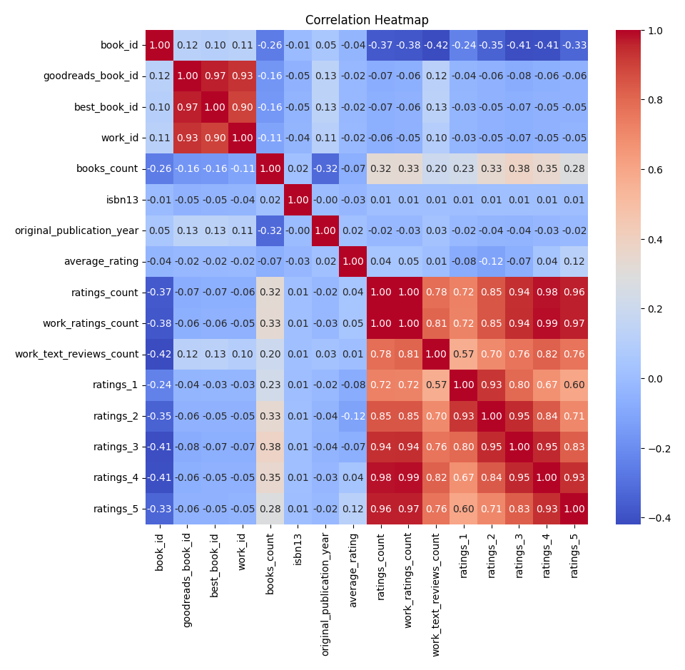

# Automated Data Analysis

The dataset at hand consists of 10,000 entries, each representing a unique book with various attributes, providing a rich tapestry of information for analysis. With 23 columns, the dataset encompasses essential identifiers, publication details, authorship, and user ratings, making it a valuable resource for understanding trends in book preferences and reader engagement.

### Overview of the Dataset

The dataset includes key identifiers such as `book_id`, `goodreads_book_id`, `best_book_id`, and `work_id`, ensuring that each book can be uniquely tracked across different systems. Attributes like `books_count`, `isbn`, and `isbn13` provide additional bibliographic details. The columns `authors`, `original_publication_year`, `original_title`, and `title` offer contextual information about each book's creation and identity.

### Missing Values

Upon examining the dataset, several columns exhibit missing values. Notably, the `isbn` column is missing 700 entries, while `isbn13` is missing 585 entries. Additionally, `original_publication_year` has 21 missing values, and `original_title` has 585 missing entries. The `language_code` field is also notably incomplete, with 1,084 missing values. Addressing these missing values is crucial for ensuring the robustness of any analysis performed on this dataset.

### Summary Statistics

The summary statistics reveal intriguing insights into the books contained within this dataset:

- The average rating across all books is approximately 4.00, indicating a generally positive reception among readers.
- The `ratings_count` column shows an average of over 54,000 ratings per book, suggesting a high level of engagement and interaction from the Goodreads community.
- The distribution of ratings across different categories (1 to 5) demonstrates a tendency for users to rate books positively, with the highest average ratings (ratings of 4 and 5) accumulating the most counts.
- The original publication year spans a wide range, with books published as far back as -1750 and as recent as 2017, allowing for a diverse historical perspective on literature.

### Correlation Analysis

The correlation heatmap generated from the dataset highlights key relationships between various attributes. For instance, there is a strong positive correlation between `average_rating` and `ratings_count`, indicating that books with higher ratings tend to receive more reviews. This insight can guide authors and publishers in understanding the importance of maintaining quality to attract more readers.

### Key Insights

1. **Quality and Popularity**:

## Visualizations

