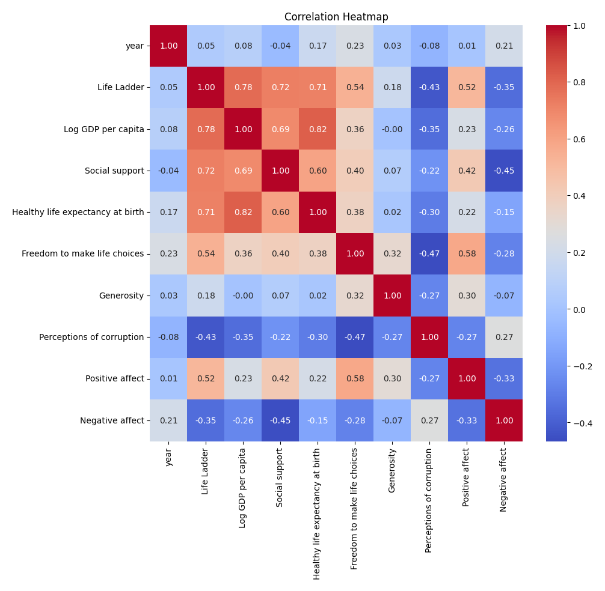
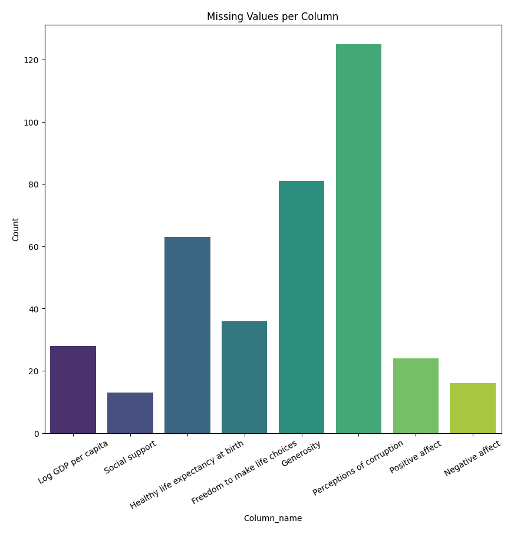

# Automated Data Analysis

### Story Summary of the Dataset and Analysis

#### Introduction to the Dataset
The dataset encompasses a broad range of indicators related to well-being across different countries and years, with a total of 2,363 entries and 11 attributes. These metrics include various dimensions of life satisfaction, economic performance, social support, and perceptions of quality of life, collectively aimed at understanding the factors that contribute to happiness and well-being globally.

#### Key Attributes and Their Importance
The dataset includes the following key columns:
- **Country Name**: Identifies the country.
- **Year**: The year of the recorded data.
- **Life Ladder**: A measure of subjective well-being, representing overall life satisfaction.
- **Log GDP per capita**: The logarithm of GDP per capita, indicating economic performance.
- **Social Support**: Reflects the perceived support available in times of need.
- **Healthy Life Expectancy at Birth**: An indicator of health outcomes.
- **Freedom to Make Life Choices**: Measures the freedom individuals feel they have in making life decisions.
- **Generosity**: A metric indicating the tendency to give.
- **Perceptions of Corruption**: Indicates the level of perceived corruption in a country.
- **Positive Affect**: A measure of positive emotions experienced.
- **Negative Affect**: A measure of negative emotions experienced.

#### Missing Values Analysis
The dataset exhibits varying levels of missing values across attributes:
- **Log GDP per capita** has 28 missing entries.
- **Social support** has 13 missing entries.
- **Healthy life expectancy at birth** is missing for 63 entries.
- **Freedom to make life choices** has 36 missing entries.
- **Generosity** is notably missing for 81 entries, which may indicate challenges in measuring altruism across different cultures.
- **Perceptions of corruption** has 125 missing entries, suggesting potential issues with data collection in specific regions.
- **Positive and Negative Affect** also have missing values, albeit to a lesser extent.

Visualizations depicting the extent of missing values provide a clear representation of these gaps, highlighting areas where caution is needed in analysis.

#### Summary Statistics
The summary statistics reveal intriguing insights:
- The average **Life Ladder** score is approximately 5.48, indicating a moderate level of life satisfaction among surveyed individuals.
- The mean **Log GDP per capita** stands at about 9.40, suggesting significant disparities in economic performance among countries.
- A striking observation

## Visualizations

