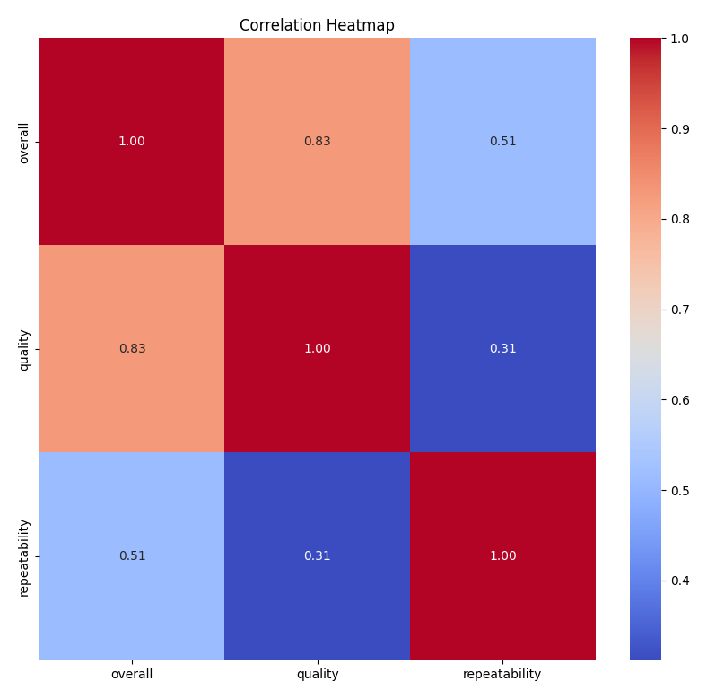
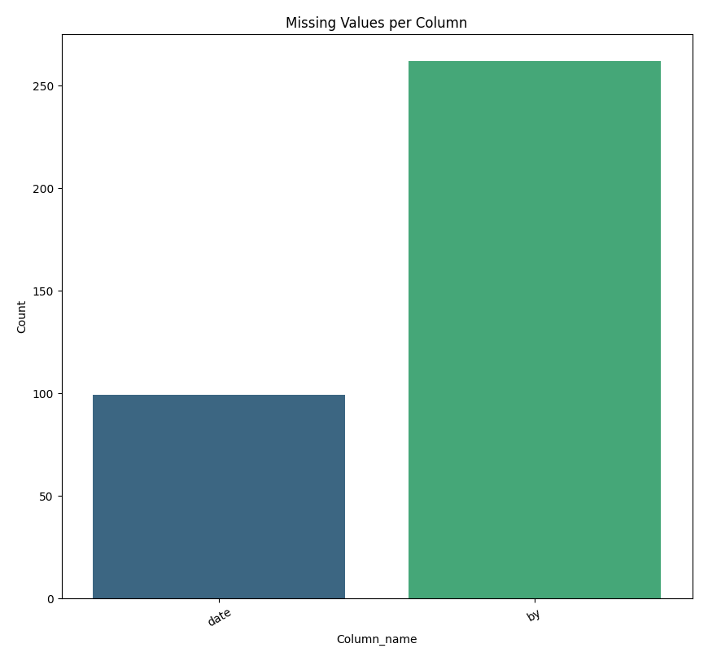

# Automated Data Analysis

### Dataset Overview

The dataset comprises 2,652 records spread across 8 columns, capturing various aspects of an evaluation or feedback system. The key columns include:

- **date**: The date on which the evaluation was made, though it contains 99 missing values.
- **language**: The language used for the evaluation, with no missing entries.
- **type**: The category of the evaluation, also free of missing values.
- **title**: The title associated with the evaluation, complete without missing values.
- **by**: The identifier for the evaluator, which has 262 missing values.
- **overall**: An integer rating that represents the overall assessment of the item, with no missing values.
- **quality**: A rating reflecting the quality of the item, again without missing data.
- **repeatability**: An integer indicating how repeatable the evaluation was, with no missing values.

### Missing Values Analysis

The dataset exhibits some missing values, particularly in the 'date' and 'by' columns. Specifically, 99 entries in the 'date' column are missing, which may impact time-series analyses or trends over time. Additionally, the 'by' column has 262 missing values, indicating a significant number of evaluators are not identified. Addressing these missing values through imputation or exclusion may be essential for further analysis.

### Summary Statistics

The overall ratings reveal interesting patterns:

- **Overall Rating**: The mean overall rating is approximately 3.05, suggesting a generally positive assessment, but the standard deviation of 0.76 indicates variability in responses. The ratings are concentrated around the lower end, with 75% of evaluations falling between 3 and 5.
  
- **Quality Rating**: With a mean of about 3.21 and a standard deviation of 0.80, the quality ratings are slightly higher than the overall ratings. This suggests that while overall assessments may fluctuate, perceived quality remains relatively stable, with a majority scoring between 3 and 4.

- **Repeatability Rating**: The repeatability mean is considerably lower at approximately 1.49, with a majority of evaluations scoring either 1 or 2. This indicates that many evaluations may not be consistently replicable, which could be a critical area for improvement.

### Correlation Insights

The correlation heatmap visualization further elucidates relationships among the numerical variables. Notably:

- **Overall and Quality Ratings**: A strong positive correlation exists

## Visualizations

